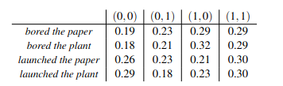

# Towards Sheaf Contextuality for Quantum Machine Learning
#### Quantum Learning Models for Predicting Contextuality

What is the defining feature that distinguishes quantum from classical information processing?  One possible answer is enshrined in the now Nobel Prize winning inequalities proposed by John Bell.  These inequalities demonstrated that the statistics generated by certain quantum systems contained correlations that could not be generated by any classical sources.  Bell's work was arguably the catalyst to launch what is now known as the 'second quantum revolution'.

We're now a few decades past Bell's achievement and into the era of NISQ and parameterized quantum circuits.  If contextuality is the key difference between the quantum and classical world, how do we utilize it to design better quantum information processing systems?  This question was recently given an answer in [1] for quantum machine learning.  In [1], the authors extend the framework of 'generalized contextuality' proposed in [2] and apply it to both classical and quantum learning models.  The idea here is twofold.  First, to design quantum learning models that perform better than their classical counterparts we should look for data that exhibits contextuality.  Second, once we have such contextual data we should then encode that structure as an inductive bias in our quantum learning model.  The authors of [1] show for a toy model that a quantum learning model with a contextual inductive bias out performs a classical surrogate on data that exhibits contextuality.

The results of [1] suggest that there should be many more instances of contextual data that a quantum learning model can be tailored to.  One such instance can be found in the phenomenon of polysemy in natural language.  Polysemy is when a word or phrase has more than one possible meaning.  When polysemous words are combined into a phrase, the meaning selected for the phrase may not be predictive of the meaning of the component words.  For example, consider the phrase 'power plant' [3].  Each word 'power' and 'plant' are associated with a range of meanings with a frequency distribution.  Consider the meaning with highest frequency for each word. When the two words are combined into the phrase 'power plant', meanings for both 'power' and 'plant' are selected.  The highest frequency meanings of each word in the composite is not the same as the highest frequency meanings for each word individually.  In other words, the combination of meanings exhibits contextuality.  The approach of [3] uses the sheaf theoretic approach to contextuality first proposed in [4].  Although distinct from the generalized contextuality of [2], recent work suggests that the two are equivalent and can be translated between each other [5].

Can we leverage the recent success of natural language processing on quantum computers [7], [8] to learn a quantum model for contextual natural language data? In what follows, we'll take steps towards such models on a pair of datasets.  The first dataset [8] consists of pairs of phrases that are combined into a compound phrase whose meaning is ambiguous.  Annotators are then asked to rate how well the two meanings are consistent with each other.  We turn these into the emprical models of [4] and train a parameterized quantum circuit to reproduce its entries. We use a variation on the lambeq pipeline [9] to turn input sentences into PennyLane quantum circuits.  For the second dataset we use the computed empirical models of [10] downloaded from [11].  Again, we train parameterized quantum circuits to reproduce its entries.  For an example of an emprical model see Figure 1 in the notebook.

 

 
*Figure 1: An example empirical model from [10]. Here the measurement contexts are different combinations of words. Each word has two possible meanings (ie, measurement outcomes) which is tabulated in the columns.  The resulting probability distribution for each row is computed.*  In what follows we encode each measurement context as a parameterized quantum circuit and train the model to reproduce the table.

 

## References

[1] Joseph Bowles et al. "Contextuality and inductive bias in quantum machine learning". In: arXiv preprint arXiv:2302.01365 (2023)

[2] Robert W Spekkens. “Contextuality for preparations, transformations, and unsharp mea-
surements”. In: Physical Review (2005)

[3] Daphne Wang et al. "On the Quantum-like Contextuality of Ambiguous Phrases". In: arXiv preprint arXiv:2107.14589

[4] Samson Abramsky and Adam Brandenburger. "The sheaf theoretic structure of non-locality and contextuality". In: New J. Phys. (2011)

[5] Linde Wester. "Almost Equivalent Paradigms of Contextuality". In: arXiv preprint arXiv:1708.00843 (2018)
        
[6] Bob Coeke et al. "Foundations for Near-Term Quantum Natural Language Processing". In: arXiv preprint arXiv:2012.03755 (2020)

[7] Amin Karamlou, Marcel Pfaffhauser, James Wootton. "Quantum Natural Language Generation on Near-Term Devices". In: arXiv preprint arXiv:2211.00727

[8] Janosch Haber and Massimo Poesio. "Word Sense Distance in Human Similarity Judgements and Contextualised Word Embeddings".  In: Proceedings of the Probability and Meaning Conference (2020)

[9] Dimitri Kartsaklis et al. "lambeq: An Efficient High-Level Python Library for Quantum NLP". In: arXiv preprint arXiv:2110.04236

[10] Daphne Wang and Mehrnosh Sadrzadeh. "The Causal Structure of Semantic Ambiguities". In: arXiv preprint arXiv:2206.06807 (2022)

[11] Daphne Wang. "Causality of lexically ambiguous phrases". In: https://github.com/wangdaphne/Causality-of-lexically-ambiguous-phrases
